<!-- Bannière professionnelle -->

<p align="center">
   
</p>
<!-- ===================================================== -->
<!-- PRÉSENTATION ANIMÉE                                    -->
<!-- ===================================================== -->

<p align="center">
  <a href="https://git.io/typing-svg">
    
  </a>
</p>

<!-- ===================================================== -->
<!-- LIENS PROFESSIONNELS                                   -->
<!-- ===================================================== -->

<p align="center">
  <a href="https://www.linkedin.com/in/mohamed-youssef-915796250/">
    
  </a>

  <a href="mailto:yussefnegotiumx@gmail.com">
    
  </a>

  <a href="https://github.com/yussefnegotiumx-stack">
    
  </a>
</p>

---

## 👨‍💼 À propos de moi

Je suis **élève ingénieur en Génie Financier à l’EMSI**, spécialisé dans la **modélisation quantitative**, l’**actuariat**, la **finance d’entreprise** et l’**analyse des risques financiers**.

Porté par une solide approche quantitative et une vision stratégique de la finance d’entreprise, je m’intéresse à la conception de solutions capables de transformer les données financières en recommandations fiables, interprétables et directement exploitables par les décideurs.

Mon profil associe :

- la rigueur analytique ;
- les méthodes quantitatives ;
- la modélisation mathématique ;
- l’optimisation ;
- la data science ;
- l’analyse financière ;
- le contrôle de gestion ;
- la gestion des risques ;
- l’aide à la décision.

Mon objectif est de développer des outils permettant d’accompagner les organisations dans :

- l’évaluation de la performance ;
- l’optimisation de l’allocation des ressources ;
- la maîtrise des risques financiers ;
- le pilotage de la rentabilité ;
- l’amélioration de la qualité des décisions budgétaires.

---

## 🚀 Projet actuel

### Outil d’aide à la décision budgétaire

Je travaille actuellement sur le projet suivant :

> **Conception d’un outil d’aide à la décision budgétaire : optimisation multi-objectif et analyse des préférences par utilité additive pour le pilotage de la marge.**

Ce projet consiste à concevoir une application intelligente permettant de sélectionner, comparer et prioriser un portefeuille de projets en tenant compte simultanément de plusieurs critères financiers, opérationnels et stratégiques.

### Critères étudiés

- budget disponible ;
- coût des projets ;
- marge attendue ;
- niveau de risque ;
- charge de travail ;
- priorité stratégique ;
- rentabilité ;
- préférences du décideur.

### Objectifs du projet

- Optimiser l’allocation du budget disponible.
- Maximiser la marge globale du portefeuille.
- Limiter l’exposition aux risques.
- Comparer différentes stratégies de sélection.
- Intégrer les préférences du décideur.
- Identifier les meilleurs compromis entre coût, risque et rentabilité.
- Fournir des résultats transparents et interprétables.
- Générer automatiquement des recommandations pour le pilotage financier.

### Méthodes mobilisées

```text
Optimisation multi-objectif
│
├── Modélisation du sac à dos binaire
├── Optimisation exacte avec OR-Tools
├── Algorithme glouton
├── Normalisation des critères
├── Fonction d’utilité additive
├── Priorités lexicographiques
├── Analyse du front de Pareto
├── Analyse de sensibilité
└── Simulation Monte Carlo
